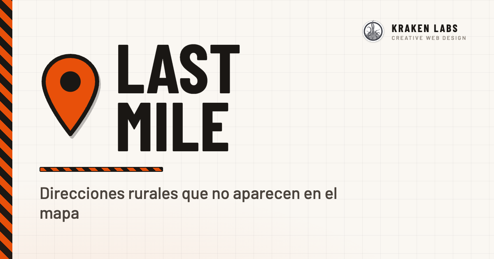

<p align="center">
	
</p>

<h1 align="center">Last Mile</h1>

<p align="center">
	<strong>Direcciones rurales que no aparecen en el mapa.</strong><br />
	PWA offline para repartidores en zonas de campo y diseminados.<br />
	<a href="https://lastmile.chemaalfonso.com">lastmile.chemaalfonso.com</a>
</p>

<p align="center">
	
	
	
	
	
</p>

---

## El problema

Miles de casas de campo tienen dirección oficial — *"Partida El Boch 100"*, *"Camino del Almajal 12"* — pero **no existen para Google Maps ni para ningún GPS comercial**. Quien reparte en estas zonas pierde tiempo en cada entrega, y los servicios de emergencia no encuentran las viviendas.

Last Mile lo resuelve dos veces:

1. **Base oficial**: incluye las direcciones rurales del [Catastro](https://www.catastro.hacienda.gob.es/webinspire/index.html) (datos abiertos) por población, con sus coordenadas exactas — partidas, diseminados, caminos, veredas y barrios de huerta que ningún mapa comercial conoce.
2. **Base personal**: cuando llegas a un sitio que ni el Catastro clava, fijas el punto exacto con el GPS o tocando el mapa, le pones nombre y notas para llegar ("portón verde tras la curva") y queda guardado para la próxima.

## Características

- 🔍 **Búsqueda unificada en tres fuentes**: tus direcciones, la base oficial de tu zona y OpenStreetMap (Nominatim) — cada resultado con su etiqueta de origen. Insensible a acentos y por palabras sueltas, con resultados agrupados por partida: `cachap 10` muestra *Cachapets* y *El Cachap* con su recuento, y al entrar filtra los números que empiezan por 10.
- 🗂️ **Navegador de partidas**: con el buscador vacío, explora todas las partidas de tus zonas y baja hasta la casa tocando — pensado para quien no sabe qué teclear.
- 🏷️ **Casas sin número incluidas**: los puntos S/N del Catastro entran con su identificador real de campo (*Políg. 20 · Parc. 295*), buscable tal y como lo escribiría el vecino.
- 📍 **Punto exacto, no aproximado**: fija por GPS (con círculo de precisión) o tocando el mapa, y afina arrastrando el pin.
- ✏️ **Todo es corregible**: si el Catastro tiene un punto mal, edítalo — nombre, notas, posición. Tus correcciones se conservan al actualizar el dataset y viajan en tus copias de seguridad.
- 📴 **Offline de verdad, mapa incluido**: al descargar tu zona se instala también el mapa vectorial de la comarca (PMTiles): la app, los puntos y el propio mapa funcionan sin cobertura. Con conexión se ve el OSM normal; sin ella, la comarca se dibuja desde tu móvil.
- 🚗 **Ruta sin conexión**: guiado giro a giro sin red — cálculo A\* en el propio móvil sobre el grafo de caminos de la comarca (OpenStreetMap), con seguimiento GPS anclado, indicaciones en español, recálculo por desvío, tramo final a la casa y pantalla siempre encendida. Complementa (no sustituye) al botón de ruta de Google.
- 🤝 **Compartir entre repartidores**: pasa tus puntos y correcciones a un compañero con la hoja de compartir nativa; al importar, lo tuyo siempre prevalece en caso de conflicto.
- 🔒 **Privacidad total**: no hay servidor ni cuentas. Tus direcciones viven únicamente en tu dispositivo (IndexedDB). Exporta/importa un JSON para respaldo o para pasarlas a otro móvil.
- 📱 **Instalable**: PWA a pantalla completa desde Chrome/Safari — icono propio, arranque instantáneo y actualizaciones automáticas (datos, mapa y grafo avisan con "Actualizar" cuando hay versión nueva).
- 🗺️ **Escala**: renderizado por canvas con recorte por zoom y encuadre — 30.000 puntos con búsqueda a <1 ms por tecleo.

## Poblaciones incluidas

Catálogo actual (~19.200 puntos oficiales, Vega Baja y Baix Vinalopó). Cada usuario descarga solo su zona desde Ajustes:

| Población | Puntos | Población | Puntos |
|---|---:|---|---:|
| Orihuela | 8.261 | Almoradí | 943 |
| Crevillent | 3.880 | Cox | 255 |
| Albatera | 1.641 | Granja de Rocamora | 145 |
| Callosa de Segura | 1.519 | San Isidro | 105 |
| Catral | 1.389 | Dolores | 1.037 |

### Añadir una población

```bash
python3 tools/build_dataset.py <código_municipio> <id> "<Nombre>"
# ejemplo:
python3 tools/build_dataset.py 03059 crevillent Crevillent
```

El script (solo librería estándar, sin pip) descarga el GML INSPIRE del Catastro, conserva únicamente los tipos de vía rurales (partida, diseminado, camino, vereda, lugar, barrio…), limpia los nombres, deduplica por zona+número, convierte las coordenadas de UTM ETRS89 a WGS84 y actualiza el manifiesto `data/index.json` con control de versiones — las poblaciones ya descargadas por los usuarios muestran "Actualizar" automáticamente.

> Guía operativa completa (filtrado, caso especial PL, tramos S/N y enriquecimiento OVC, calidad de nombres y contrato de estabilidad de ids): [`docs/datasets.md`](docs/datasets.md).

## Desarrollo

Sin build, sin bundler, sin npm — ficheros estáticos y un directorio de datos:

```bash
python3 -m http.server 8000
# → http://localhost:8000
```

> Sirve siempre por HTTP: abrir `index.html` como archivo rompe el service worker, IndexedDB y la geolocalización.

> Mapa offline (base vectorial PMTiles para navegar sin cobertura): cómo se genera con `tools/build_basemap.py`, cómo servirlo en nginx (nunca comprimir el `.pmtiles`) y la atribución ODbL/OpenStreetMap obligatoria en [`docs/offline-map.md`](docs/offline-map.md). En local usa `python3 tools/dev_server.py 8000` (soporta peticiones Range, que `http.server` no).

> Grafo de rutas (para la "Ruta sin conexión"): se construye desde OpenStreetMap con `tools/build_routing.py`; el formato compacto, el A\*, las decisiones de filtrado y la licencia ODbL están en [`docs/offline-routing.md`](docs/offline-routing.md). La receta completa para crecer (añadir poblaciones y regenerar mapa + grafo) está en [`docs/growth.md`](docs/growth.md).

El código son ficheros planos que comparten ámbito global, cargados en orden (`js/config.js`, `js/db.js`, `js/map.js`, `js/search.js`, `js/towns.js`, `js/routing.js`, `app.js`). La arquitectura se apoya en tres capas de persistencia: `addresses` (IndexedDB — tus puntos), `places` (IndexedDB — puntos oficiales por población, con ediciones marcadas) y `localStorage` (ajustes y visibilidad). El detalle completo está en [CLAUDE.md](CLAUDE.md).

## Créditos y atribuciones

- Direcciones rurales: [Dirección General del Catastro](https://www.catastro.hacienda.gob.es/webinspire/index.html) (servicios INSPIRE, datos abiertos).
- Mapa: [Leaflet](https://leafletjs.com) © colaboradores de [OpenStreetMap](https://www.openstreetmap.org/copyright).
- Geocodificación: [Nominatim](https://nominatim.org) (respetando su política de uso).
- Tipografía: [Barlow](https://fonts.google.com/specimen/Barlow) / Barlow Condensed.

## Licencia

[MIT](LICENSE.md) — úsala, cópiala, modifícala y compártela libremente, conservando el aviso de copyright y atribución.

---

<p align="center">
	Desarrollado por <a href="https://krakenlabsweb.com"><strong>Chema Alfonso · Kraken Labs Web</strong></a>
</p>
